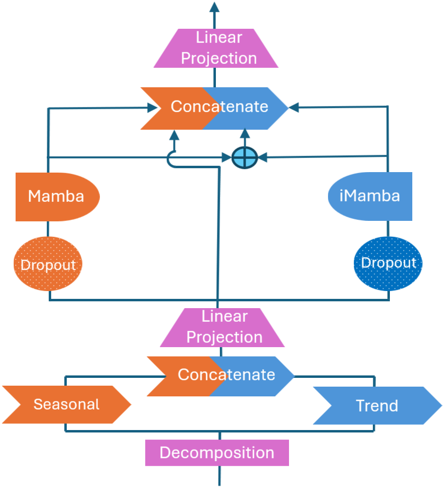
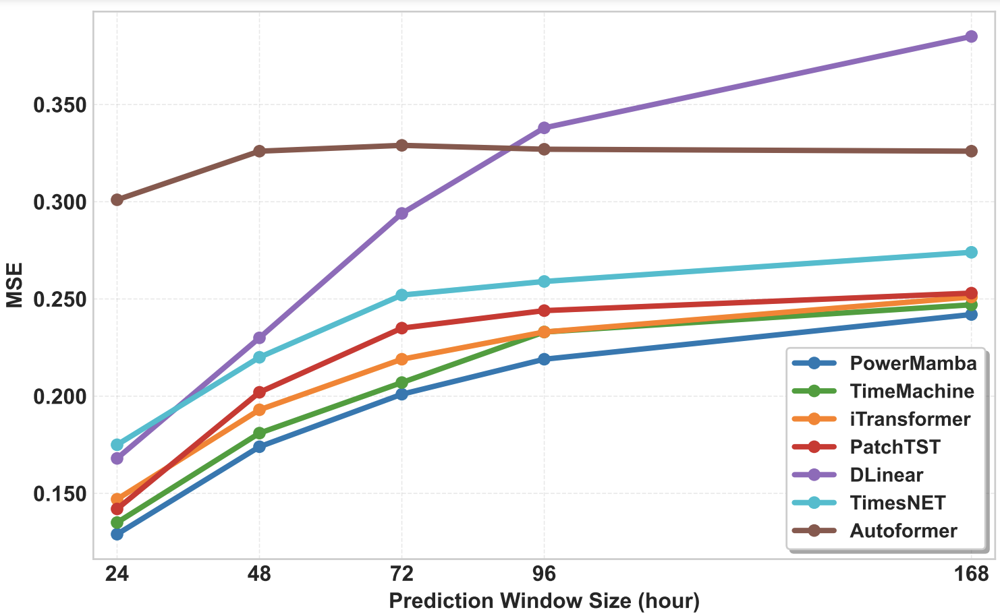

# PowerMamba: A Deep State Space Model and Benchmark for Time Series Prediction in Electric Power Systems

This repository contains the code and resources for the research project *"PowerMamba: A Deep State Space Model and Comprehensive Benchmark for Time Series Prediction in Electric Power Systems."*

<div style="display: flex; justify-content: center; gap: 20px;">
    <div style="text-align: center;">
        
        <p>PowerMamba Model: A Deep State Space Model for time series prediction in electric power systems.</p>
    </div>
    
    <div style="text-align: center;">
        
        <p>Performance Results: Demonstrates the main results of the PowerMamba model.</p>
    </div>
</div>


## Getting Started

To set up the required environment, follow these steps:

```bash
conda env create -f environment.yml
conda activate mamba4ts
```

## Repository Overview


- **`Data Preprocessing`**: This folder includes an example script demonstrating how to gather data from the ERCOT website using a custom data scraper.
- **`PowerMamba`**: Contains the implementation of the proposed PowerMamba model along with baseline models.
- **`data`**: Includes the benchmark dataset used in this project.

Each folder contains a `README` file with more details about its contents.

# Maintainers
* [Ali Menati](github.com/alimenati)
* [Fatemeh Doudi](https://fatemehdoudi.github.io/)


