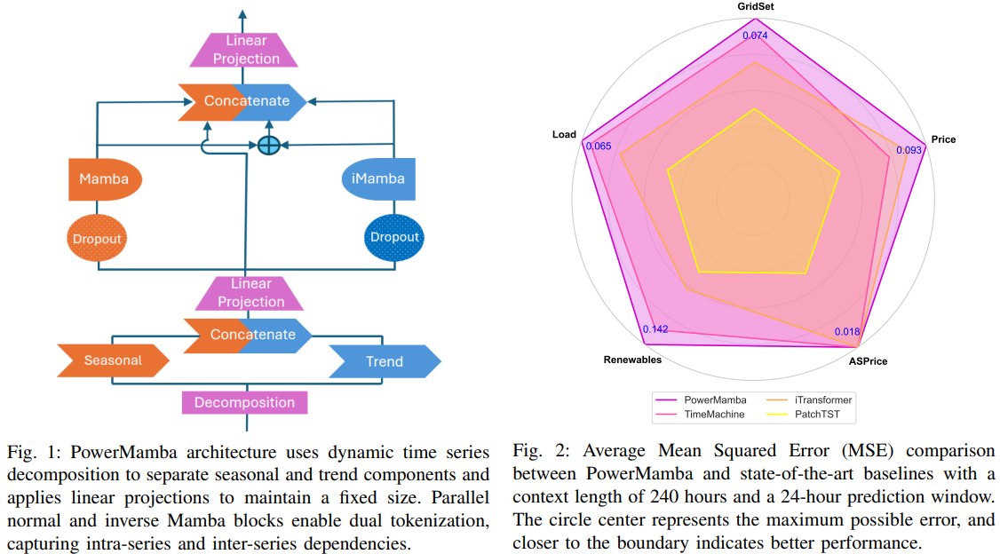
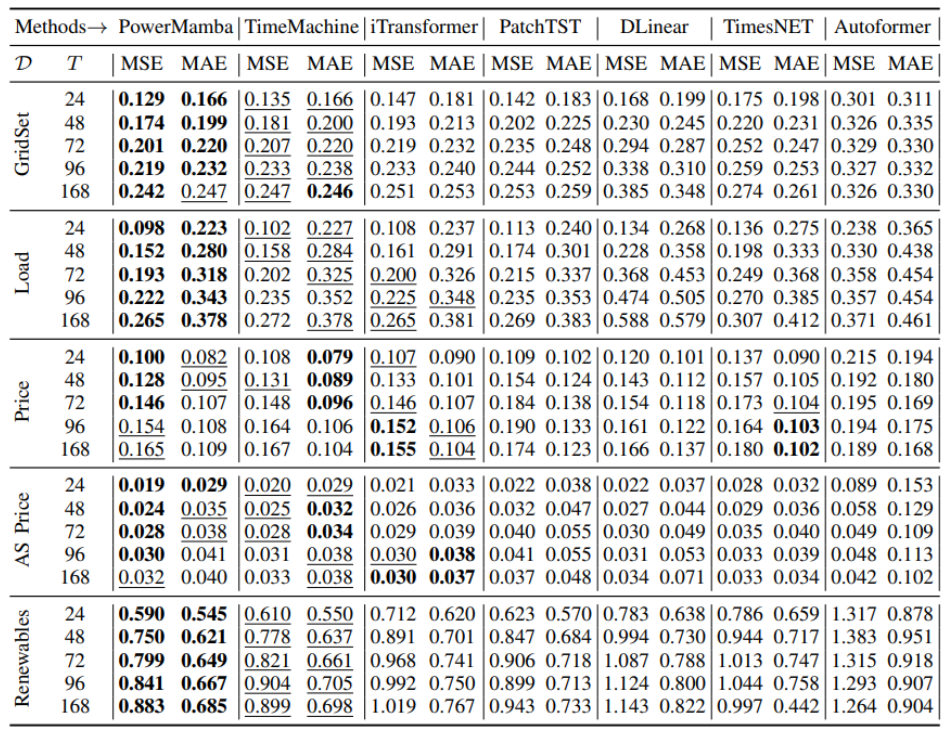
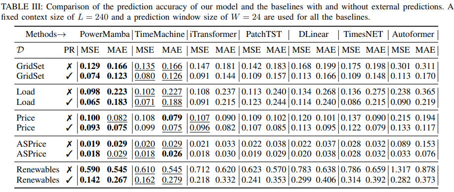
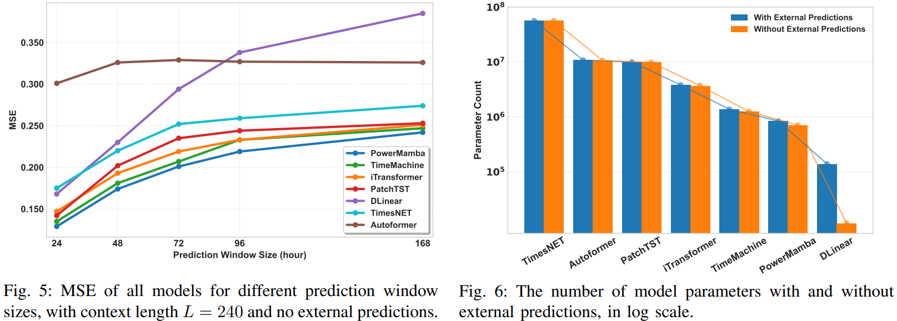
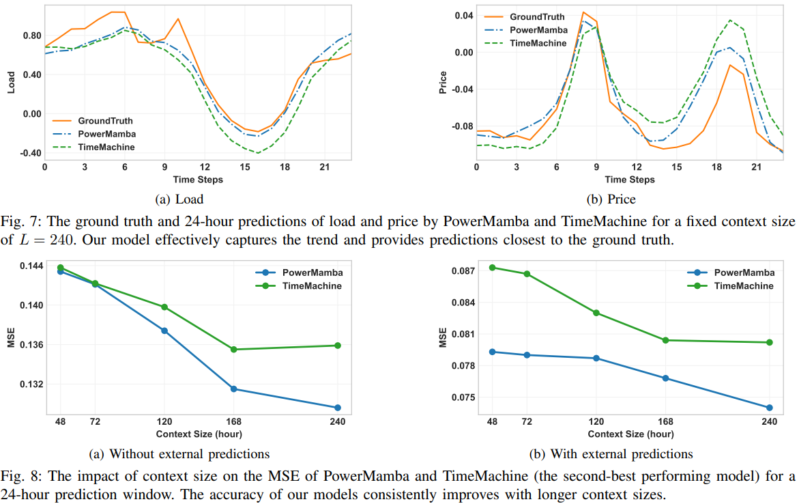

# PowerMamba: A Deep State Space Model and Benchmark for Time Series Prediction in Electric Power Systems

This repository contains the code and resources for the research project *"PowerMamba: A Deep State Space Model and Comprehensive Benchmark for Time Series Prediction in Electric Power Systems."*

Our main proposal and the performance are shown in the next two figures:

<div style="text-align: center;">
    
    <p>PowerMamba Model: A Deep State Space Model for time series prediction.</p>
</div>


<div style="text-align: center; margin-top: 20px;">
    
    
    <p>Performance Results: Demonstrates the main results of the PowerMamba model on a power grid dataset, in the case where an external dataset is not incorporated.</p>
</div>


## Getting Started

To set up the required environment, follow these steps:

```bash
conda env create -f environment.yml
conda activate mamba4ts
```

## Repository Overview

- **`PowerMamba`**: Contains the implementation of the proposed PowerMamba model along with baseline models.
- **`data`**: Includes the benchmark dataset used in this project.

Each folder contains a `README` file with more details about its contents.

# Maintainers
* [Ali Menati](github.com/alimenati)
* [Fatemeh Doudi](https://fatemehdoudi.github.io/)


