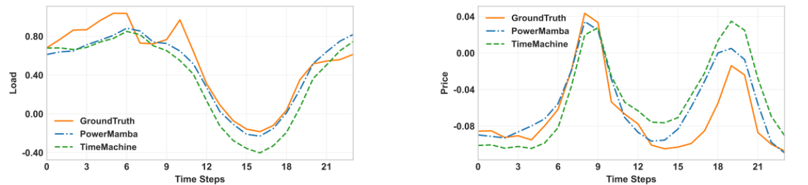

# <center>PowerMamba</center>

This repository contains the code and resources for the research project "[PowerMamba: A Deep State Space Model and Comprehensive Benchmark for Time Series Prediction in Electric Power Systems](https://arxiv.org/abs/2412.06112)."

We release a comprehensive dataset for the Electric Reliability Council of Texas (ERCOT) grid, which includes zonal loads, zonal electricity prices, ancillary service prices, and renewable generation time series with hourly granularity. This dataset spans five years and provides zonal-level spatial resolution, featuring 22 core time series and an extended version with 262 channels that includes external forecasts. The architecture and performance of our prediction model are presented in the following figures:

<div style="text-align: center;">
    
</div>

**Left**) PowerMamba architecture. The model uses dynamic time series
decomposition to separate seasonal and trend components and
applies linear projections to maintain a fixed size. Parallel
normal and inverse Mamba blocks enable dual tokenization,
capturing intra-series and inter-series dependencies. **Right**) Average Mean Squared Error (MSE) comparison
between PowerMamba and state-of-the-art baselines with a
context length of 240 hours and a 24-hour prediction window.
The circle center represents the maximum possible error, and
closer to the boundary indicates better performance. PowerMamba outperforms current benchmarks in all prediction tasks. 


**Results without External Forecasts:** We propose a time series processing block that seamlessly integrates high-resolution external forecasts into our models and other sequence-to-sequence frameworks. We evaluate its effectiveness by considering two scenarios: first, we train with historical data alone, and then we incorporate external forecasts and compare the results. The following Table shows the prediction results for the case without external predictions.


**Results with Integrating Externla Forecasts:** Next, we integrate the external predictions provided for load and renewable generation into our dataset. The following Table compares the prediction accuracy of our model and the baselines with and without external predictions. A fixed context size of L = 240 and a prediction window size of W = 24 are used for all the baselines.


The results indicate that our model's performance improves for all time series even those without external predictions. For example, price
prediction error is reduced by 7%, despite the absence of external price predictions.


**Computational Efficiency:** As shwon below, PowerMamba is highly robust and it consistently outperforms other models in both short- and long-
term predictions. We also compare the number of trainable parameters for all the baseline models.

<div style="text-align: center; margin-top: 20px;">
    
    
**Left Figure**) MSE of all models for different prediction window
sizes, with context length L = 240 and no external predictions. **Right Figure**) The number of model parameters with and without
external predictions, in log scale.

PowerMamba enhances the average prediction error of TimeMachine by 7% while employing 43% fewer parameters,
thereby highlighting its superiority over this state-of-the-art
Mamba-based model. Furthermore, PowerMamba is considerably smaller than Transformer-based models, with 78% fewer
parameters than the leading iTransformer.

**Qualitative Comparison:** Although both models are able to accurately
depict load and price patterns, PowerMamba exhibits superior
alignment, especially around peaks and troughs.



The ground truth and 24-hour predictions of load and price by PowerMamba and TimeMachine for a fixed context size
of L = 240. Our model effectively captures the trend and provides predictions closest to the ground truth. 


**Context Window Size:** In this part, we investigate
the influence of varying context window sizes to determine the
extent to which increased contextual information affects model
performance.


</div>

The impact of context size on the MSE of PowerMamba and TimeMachine (the second-best performing model) for a
24-hour prediction window. **Left Figure**) Without external prediction. **Right Figure**) With external prediction. It can be seen that the accuracy of our models consistently improves with longer context sizes.

## Getting Started

To set up the required environment, follow these steps:

```bash
conda env create -f environment.yml
conda activate mamba4ts
```

## Repository Overview

- **`PowerMamba`**: Contains the implementation of the proposed PowerMamba model along with baseline models.
- **`data`**: Includes the benchmark dataset used in this project.

Each folder contains a `README` file with more details about its contents.

## Acknowledgement

We appreciate the following github repos very much for the valuable code base:
- Mamba (https://github.com/state-spaces/mamba)
- Time-Series-Library (https://github.com/thuml/Time-Series-Library)
- TimeMachine (https://github.com/Atik-Ahamed/TimeMachine)
- PatchTST (https://github.com/yuqinie98/PatchTST)
- iTransformer (https://github.com/thuml/iTransformer)
- Autoformer (https://github.com/thuml/Autoformer)
- TimesNet (https://github.com/thuml/TimesNet)
- DLinear (https://github.com/cure-lab/LTSF-Linear)


## Contact

If you have any questions or concerns, please contact us: menati@tamu.edu or fatemehdoudi@tamu.edu or submit an issue.


## Citation

If you find our codebase, dataset, or research valuable, please cite PowerMamba:

```
@misc{menati2024powermamba,      title={PowerMamba: A Deep State Space Model and Comprehensive Benchmark for Time Series Prediction in Electric Power Systems}, 
      author={Ali Menati and Fatemeh Doudi and Dileep Kalathil and Le Xie},      year={2024},
      eprint={2412.06112},      archivePrefix={arXiv},
      primaryClass={cs.LG},      url={https://arxiv.org/abs/2412.06112}, 
}
```


